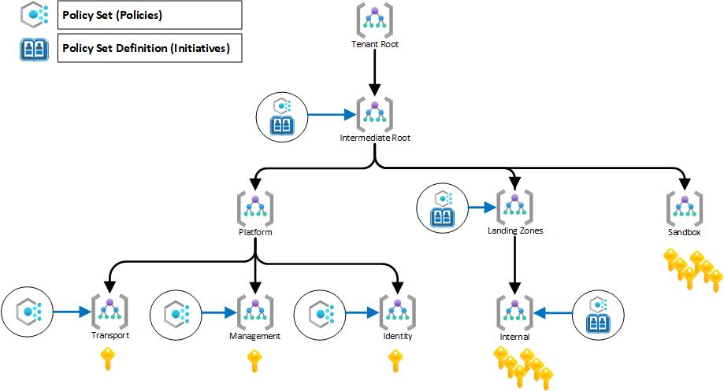

# Overlays: NoOps Accelerator - Management Groups

## Authored & Tested With

* [azure-cli](https://docs.microsoft.com/en-us/cli/azure/install-azure-cli) version 2.38.0
* bicep cli version v0.9.1
* [bicep](https://marketplace.visualstudio.com/items?itemName=ms-azuretools.vscode-bicep) v0.9.1 vscode extension

### Module Tested on

* Azure Commercial ✔️
* Azure Government ✔️
* Azure Government Secret ✔️
* Azure Government Top Secret ❔

> ✔️ = tested,  ❔= currently testing

## Navigation

  - [Overview](#overview)
  - [Prerequisites](#prerequisites)
  - [Architecture](#architecture)
  - [Deployment](#deployment)
  - [Parameters](#parameters)
  - [Outputs](#outputs)
  - [Resource types](#resource-types)
  - [Air-Gapped Clouds](#air-gapped-clouds)
  - [Cleanup](#cleanup)
  - [Example Output in Azure](#example-output-in-azure)

## Overview

The Enclave Management Groups module deploys a management group hierarchy in a tenant under the `Tenant Root Group`.  This is accomplished through a tenant-scoped Azure Resource Manager (ARM) deployment.  The heirarchy can be modifed by editing `deploy.enclave.mg.parameters.json`.

>NOTE: This module setups up a enclave management group structure suitable for the Hub/ 3 Spoke Design. You can create other parameter files that can be used for other organizational requirement.

Module deploys the following resources:

* Enclave Management Groups

The hierarchy created by the deployment (`deploy.enclave.mg.parameters.json`) is:

* Tenant Root Group
  * Intermediate Level Management Group (defined by parameter in `parRootMg`)
    * Platform
      * Management
      * Transport
      * Identity
    * Landing Zones
      * Workloads
        * internal
          * NonProd
          * Prod
    * Sandbox

## Prerequisites

* For deployments in the Azure Portal you need access to the portal in the cloud you want to deploy to, such as [https://portal.azure.com](https://portal.azure.com) or [https://portal.azure.us](https://portal.azure.us).
* For deployments in BASH or a Windows shell, then a terminal instance with the AZ CLI installed is required.
* For PowerShell deployments you need a PowerShell terminal with the [Azure Az PowerShell module](https://docs.microsoft.com/en-us/powershell/azure/what-is-azure-powershell) installed.

> NOTE: The AZ CLI will automatically install the Bicep tools when a command is run that needs them, or you can manually install them following the [instructions here.](https://docs.microsoft.com/en-us/azure/azure-resource-manager/bicep/install#azure-cli)

## Architecture



## Deployment

The docs on Management Groups: <https://docs.microsoft.com/en-us/azure/bastion/bastion-overview>

In this overlay, the management groups are created at the `Tenant Root Group` through a tenant-scoped deployment.
The following module usage examples are retrieved from the content of the files hosted in the module's `.test` folder.
   >**Note**: The name of each example is based on the name of the file from which it is taken.
   >**Note**: Each example lists all the required parameters first, followed by the rest - each in alphabetical order.

<h3>Example 1: Azure</h3>

<details>

<summary>via Bash</summary>

```bash
# For Azure global regions
az deployment mg create \
   --template-file overlays/management-groups/deploy.bicep \
   --parameters @overlays/management-groups/deploy.enclave.mg.parameters.json \
   --location 'eastus'
```

```bash
# For Azure IL regions
az deployment mg create \
  --template-file overlays/management-groups/deploy.bicep \
  --parameters @overlays/management-groups/deploy.enclave.mg.parameters.json \
  --location 'usgovvirginia'
```

</details>
<p>

<details>

<summary>via Powershell</summary>

```powershell
# For Azure global regions
New-AzManagementGroupDeployment `
  -ManagementGroupId xxxxxxx-xxxx-xxxxxx-xxxxx-xxxx
  -TemplateFile overlays/management-groups/deploy.bicepp `
  -TemplateParameterFile overlays/management-groups/deploy.enclave.mg.parameters.json `
  -Location 'eastus'
```

OR

```powershell
# For Azure IL regions
New-AzManagementGroupDeployment `
  -ManagementGroupId xxxxxxx-xxxx-xxxxxx-xxxxx-xxxx
  -TemplateFile overlays/management-groups/deploy.bicepp `
  -TemplateParameterFile overlays/management-groups/deploy.enclave.mg.parameters.json.json `
  -Location  'usgovvirginia'
```
</details>
<p>

## Parameters

The module requires the following inputs:

**Required parameters**
| Parameter Name | Type | Description |
| :-- | :-- | :-- |
| `parRootMg` | string | Prefix for the management group hierarchy.  This management group will be created as part of the deployment. |
| `parManagementGroups` | array   | Set Parameter to true to Apply Top Level Management Group Prefix of deployment |

**Conditional parameters**
| Parameter Name | Type | Default Value | Description |
| :-- | :-- | :-- | :-- |
| `parRequireAuthorizationForGroupCreation` | bool | Display name for top level management group.  This name will be applied to the management group prefix defined in `parRootMg` parameter. |

## Outputs

This module will generate the following outputs:

| Output Name | Type | Description |
| :-- | :-- | :-- |
None

## Resource types

| Resource Type | API Version |
| :-- | :-- |
| `Microsoft.Management/managementGroups` | [2021-04-01](https://docs.microsoft.com/en-us/azure/templates/Microsoft.Management/2021-04-01/managementGroups) |
| `Microsoft.Management/managementGroups/subscriptions` | [2021-04-01](https://docs.microsoft.com/en-us/azure/templates/Microsoft.Management/2021-04-01/managementGroups/subscriptions) |

## Air-Gapped Clouds

For air-gapped clouds it may be convenient to transfer and deploy the compiled ARM template instead of the Bicep template if the Bicep CLI tools are not available or if it is desirable to transfer only one file into the air gap.

## Cleanup

The Bicep/ARM deployment of NoOps Accelerator Management Groups deployment can be deleted with these steps:

Delete all hierarchy settings defined at the Management Group level.

```bash
az account management-group hierarchy-settings delete --name GroupName
```

## Example Output in Azure


